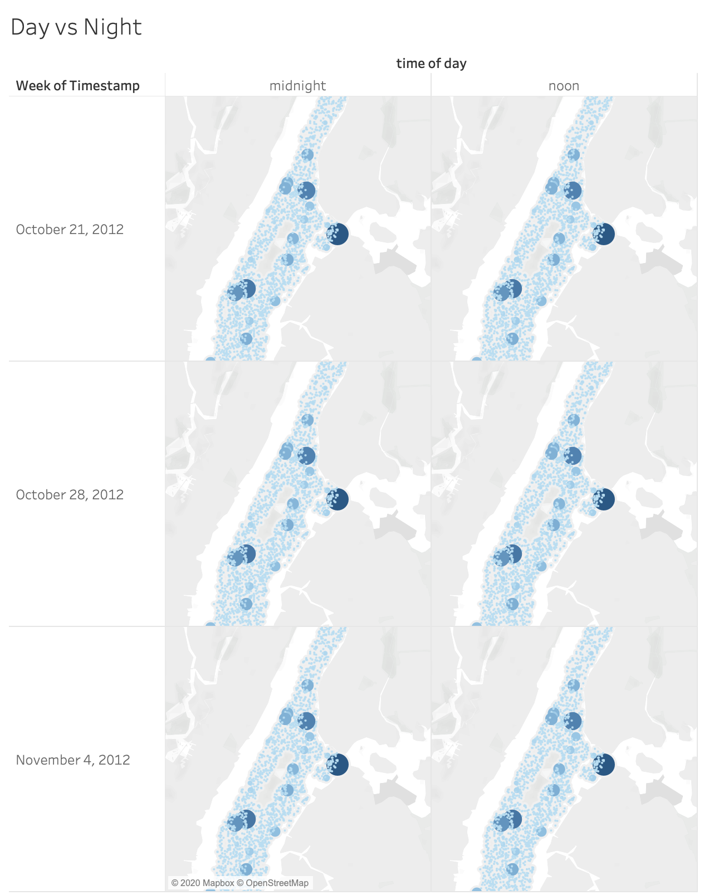
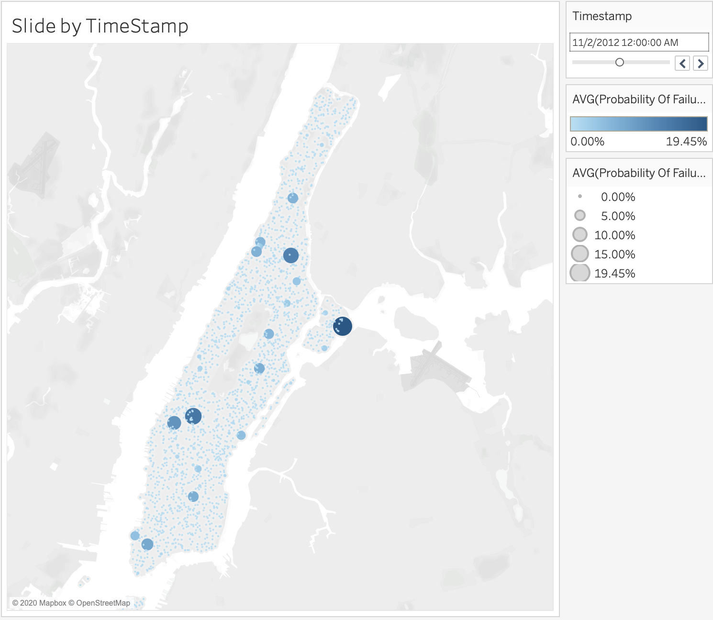

# TagUp Data Viz Technical Challenge
### Use sidebar to interact with the chart
By Willa Hua

Nov 12 2020

## Exploratory Data Analysis
The data contains asset failure probabilities of 2100 assets in NYC Manhattan, from 10/27 to 11/9, 2012, recorded 2 times a day at midnight and noon. I started by brainstorming some tasks my visualization can support, such as comparison by day and night, filter assets by threshold, explore by timestamps and aggregate data by day or week. Next, I further explored the data in Tableau, after stacking it from wide form to long form. Here're some findings:
1. Looking at the distribution by boxplots and histograms, the probabilities of asset failure changed minimally over time, compares to their absolute values. 
2. Likewise, there's no significant difference between midnight and noon, shown below.

3. The lack of visually discernable flactuation doesn't justify a small multiple approach. A slider over time (shown below) adds interactivity and is useful for monitoring equiment, but fails to highlight spikes in hazard probability.

## Goal Setting
For my visualization, I want to help my user, an asset manager, monitor risks of asset failure by performing two tasks:
1. Identify increases in risk by looking at the relative change in the probabilities of failure over time
2. Monitor assets with high absolute values of probabilities of failure

## Final Solution
I maded a two-layered map of Manhattan in Altair and used Streamlit, a Python-based data app builder, to add more flexibility in user input. I hosted the app on a virtual private server of mine. Here're some highlights of my solution:
- High risk assets have high visual prominance
- Tooltip to read further information
- Data driven chart title
- Dropdown boxes enable user customization of the timestamp for monitoring and the time frame for comparison

## Discussion
- Independent assets
By neighborhood, dispatching resources
Spatial Analysis for hot spots cool spots
- Anomalty detection, vizalert
- vs Mapbox / Leaflet / Tableau

### Sourcecode
Link
To run the app locally, run the following line in console:
> streamlit run st.py

### Time Spent
- 1 hr Tableau
- 2 hr Altair
- 1 hr Documentation and Deployment

connect
- ssh root@138.197.1.141
- Self-DrivingH0tp0t
scp to copy folder to server
- scp -r folder/ root@138.197.1.141:/root/
run
- streamlit run .py
- control z
- bg 
- disown
- control d